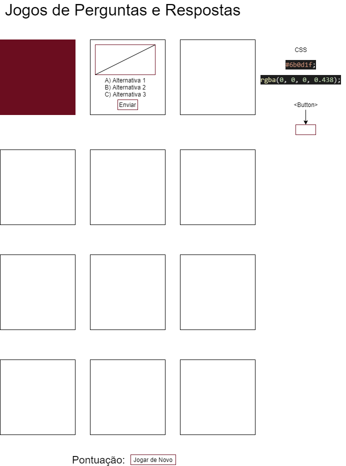
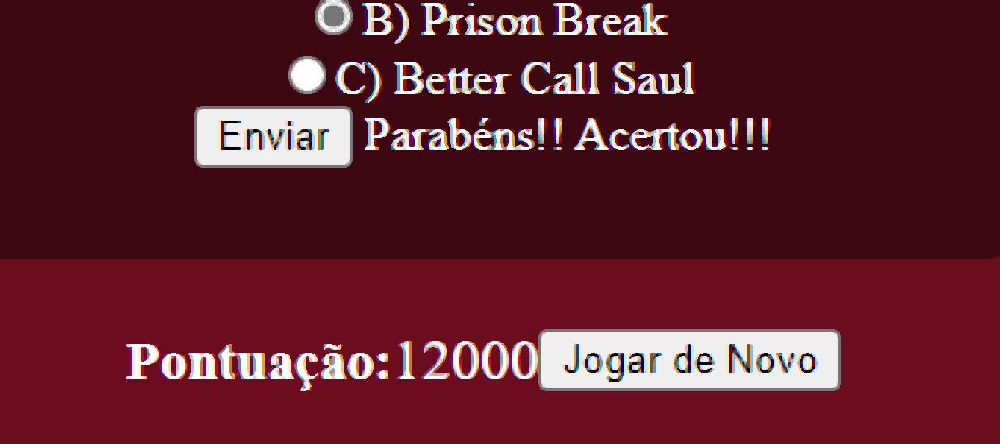

# Quiz
#### Jogo de Perguntas e Respostas 

### Wireframe
O Wireframe deste projeto considera não apenas computadores pessoais, mas também dispositivos móveis, veja abaixo a imagem do Wireframe.

### Tecnologias e Ferramentas usadas na construção do projeto:

* HTML
* CSS
* Javascript

* [Visual Studio Code](https://code.visualstudio.com/)

### Acesso ao Projeto

1ª Clone este repositório

git clone https://github.com/devjorgesousa/quiz.git

2ª Acesse a pasta do projeto no Visual Studio Code após descompactar o arquivo quiz-main.zip

cd quiz-main

3ª Abra o arquivo jogo.html que está na pasta quiz-main

### Leia o Manual do Jogo 

Link do Jogo: https://devjorgesousa.github.io/quiz/jogo.html

Quando acessar o link citado acima, o jogador terá que escolher a alternativa correta de cada questão e clicar no botão chamado "enviar".

Exemplo: Na primeira questão, escolha uma alternativa e depois clique em enviar , se acertar vai aparecer isso que mostra a imagem abaixo.
Vai receber essa mensagem: "Parabéns!! Acertou!!!"

E também vai ganhar 1000 pontos pela questão acertada.

Se o jogador errar a questão, vai receber essa mensagem: "Errou!!! Quem sabe na próxima vez!!!"

Depois de responder a primeira questão, faça o mesmo na segunda questão e sucessivamente.

Se o jogador quiser tentar acertar as perguntas a partir do início, basta ir até o final da página e clicar no botão "Jogar de Novo", e a pontuação e as alternativas marcadas irão ser apagadas e o jogador poderá jogar de novo.

A pontuação máxima que pode alcançar no jogo é 12000 pontos, sendo que uma questão acertada vale 1000 pontos.

